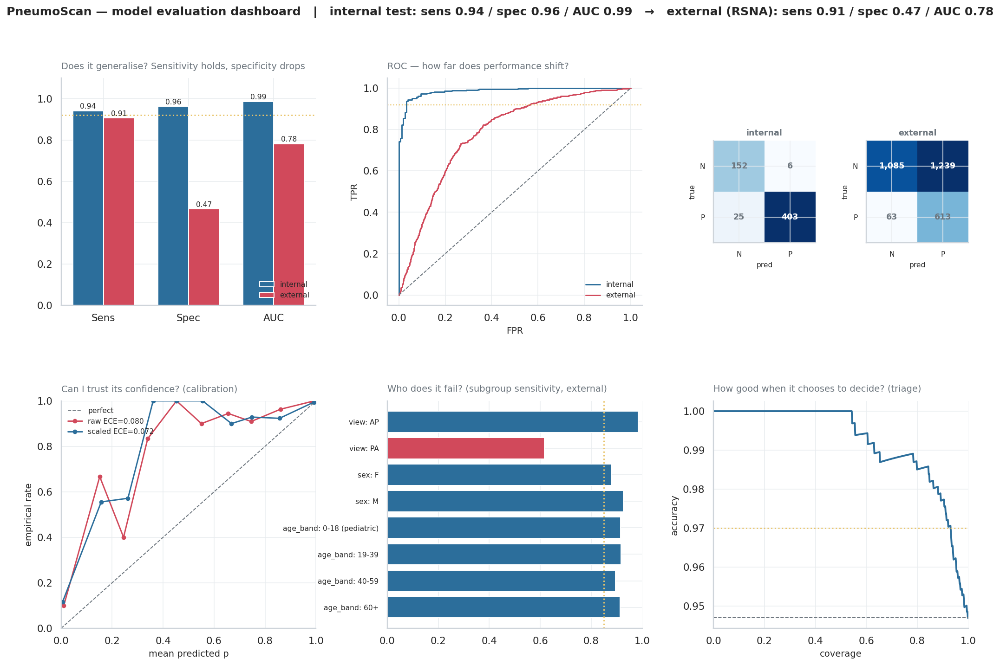
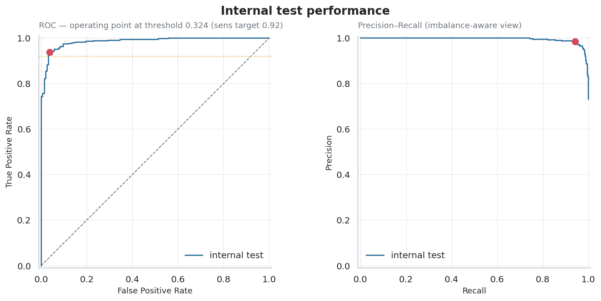
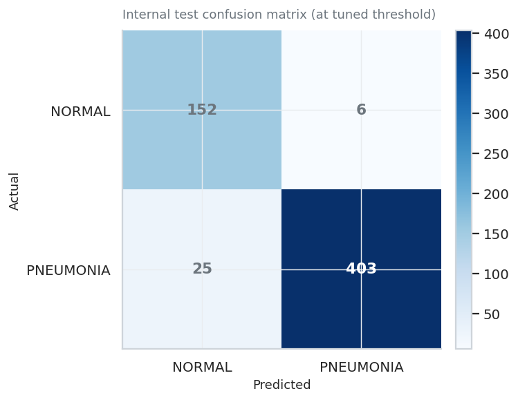
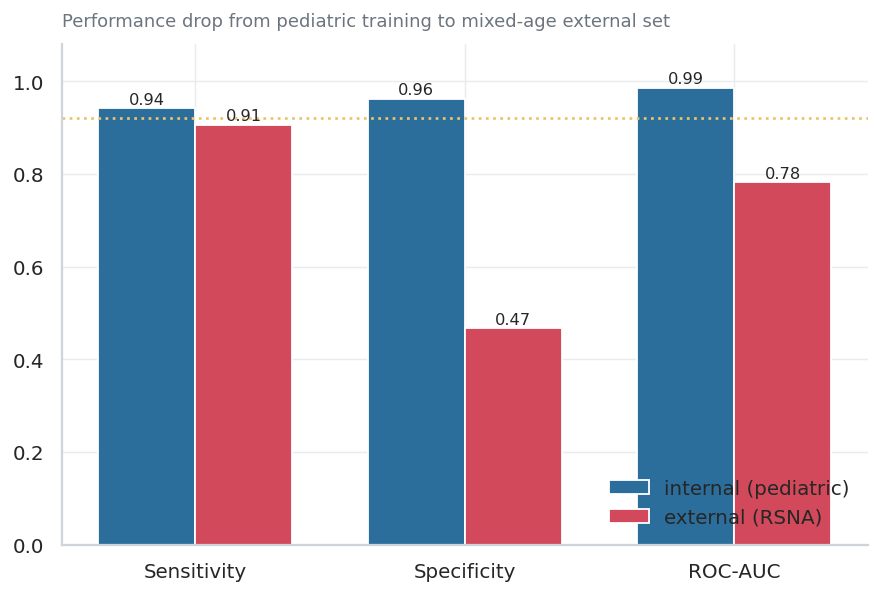
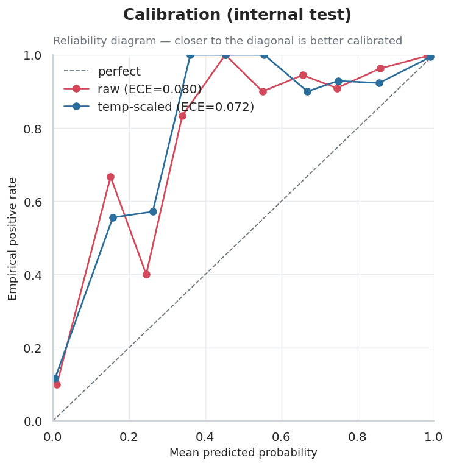
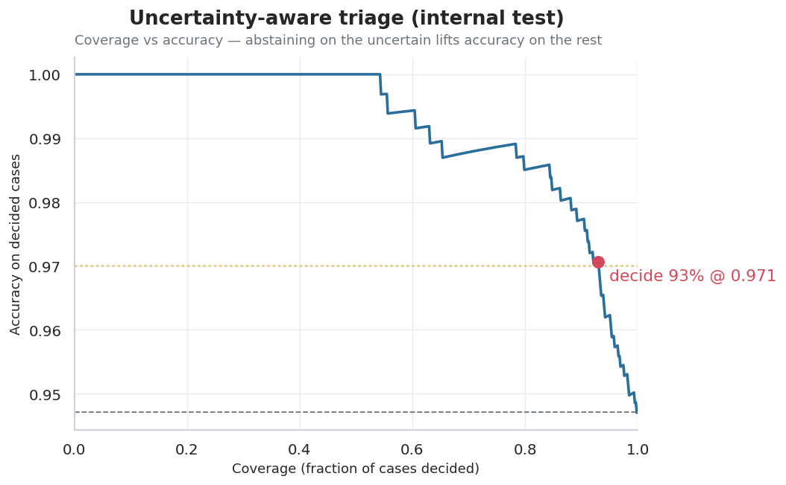
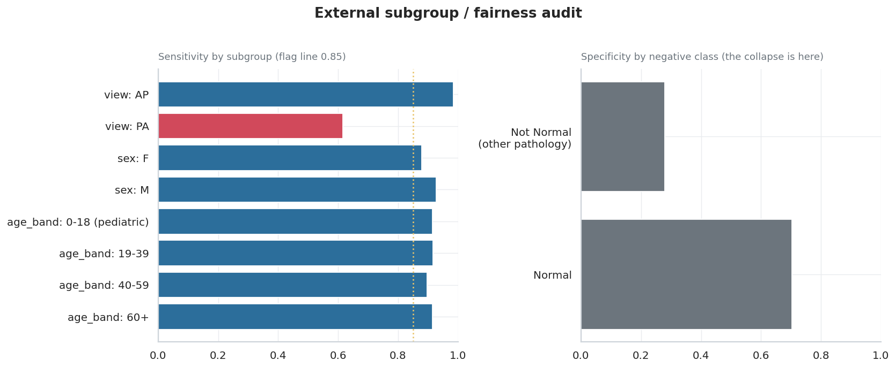
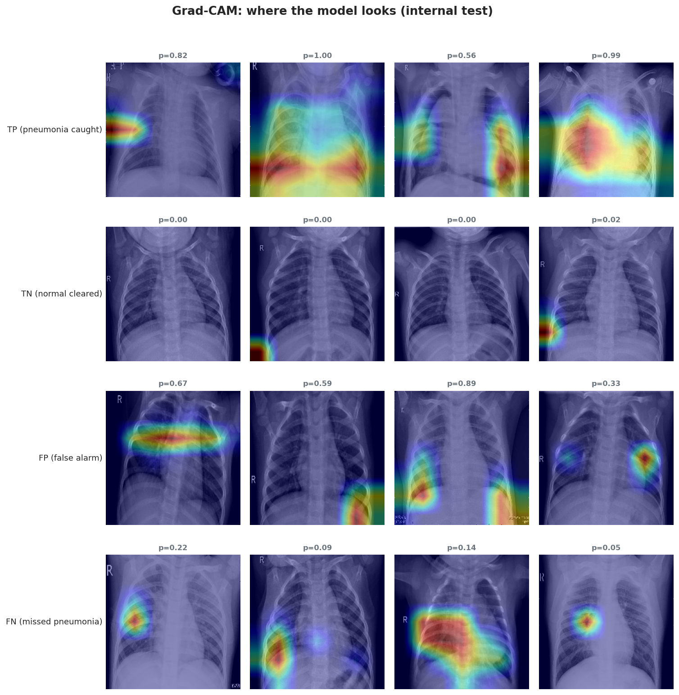

# PneumoScan — Chest X-ray Pneumonia Triage

> A DenseNet121 model that flags likely pneumonia on chest X-rays — built as a **triage** tool, where the story isn't raw accuracy but **trustworthiness**: external validation, calibration, uncertainty-aware abstention, subgroup fairness, and Grad-CAM explainability.

**🔗 Live demo:** https://pneumonia-detection-cnn-chi.vercel.app  ·  **API docs:** https://pneumoscan-api-b76x.onrender.com/docs  ·  **Model:** https://huggingface.co/decstzz06/pneumoscan-model

> ⚠️ Research/education prototype — **not a medical device**. See [MODEL_CARD.md](MODEL_CARD.md) for intended use and limitations.
> The live API is on a free tier that sleeps when idle; the **first** request may take ~50s to wake, then it's ~1s.



---

## Why this project is different

Most "pneumonia detector" projects report a single accuracy number on the same distribution they trained on. In medical triage that number is misleading — the classes are imbalanced (~3:1), a missed pneumonia costs far more than a false alarm, and a model that never leaves its training distribution tells you nothing about deployment. PneumoScan is built around the questions a clinician (or an ML reviewer at a health-AI company) would actually ask:

| Question | What I did | Result |
|---|---|---|
| Does it catch pneumonia? | Tuned the decision threshold on **validation** to hit sensitivity ≥ 0.92 | **Sensitivity 0.942** on internal test |
| Does it generalize? | **External validation** on a different dataset (RSNA, adults) it never saw | Sensitivity holds (0.907); **specificity collapses** 0.96 → 0.47 — disclosed, not hidden |
| Are its probabilities meaningful? | **Temperature scaling** for calibration | ECE 0.080 → 0.072 |
| Does it know when it's unsure? | **Abstention-based triage** — escalate uncertain cases | Decides 93% of cases at **0.971 accuracy**, escalates the rest |
| Is it fair across subgroups? | **Subgroup audit** by view / sex / age | Found a real **PA-view weakness** (sens 0.615) — disclosed |
| Where does it look? | **Grad-CAM** heatmaps | Localizes to lung opacities; some false alarms driven by image borders — disclosed |
| Does the *deployed* model match the evaluated one? | Re-scored the whole test split through the **serving** path | Caught a train/serve preprocessing skew costing **15 true positives** — fixed |

---

## The live demo

Two tabs, both driven by real data — no mock numbers anywhere.

**Analyse** — drop in a chest X-ray (or paste one, or pick from four bundled held-out test studies so you don't need your own). You get the model call, calibrated confidence, where the case landed on the 0→1 probability axis relative to the tuned threshold, the triage disposition, and a Grad-CAM overlay with fade and side-by-side comparison.

One of the bundled samples is deliberately a **borderline case that the model refuses to decide** — it lands in the abstention band and escalates. That is the product working, not failing, and it is the single thing most worth clicking.

**Model Report** — the evaluation in this README, made interactive from the exported metrics (`src/export_report.py`). Its centerpiece is a **threshold explorer**: a 201-point real sweep where dragging the operating point updates sensitivity, specificity, the confusion matrix and a moving dot on the ROC curve, so you can see exactly what a threshold change costs in missed cases versus false alarms.

---

## Results

### Internal test (held-out split of the training distribution)

| Metric | Value |
|---|---|
| Sensitivity (recall on pneumonia) | **0.942** |
| Specificity | 0.962 |
| Precision | 0.985 |
| Accuracy | 0.947 |
| ROC-AUC | 0.986 |
| PR-AUC | 0.995 |

Operating threshold = **0.324**, chosen on validation to meet the sensitivity target (moving it from the naïve 0.5 lifted test sensitivity 0.913 → 0.942). Confusion matrix: TN 152 · FP 6 · FN 25 · TP 403.

<p float="left">
  
  
</p>

### External validation — the honest part

Evaluated on **3,000 RSNA images** (a different, mostly *adult* population) at the **frozen** internal threshold — no re-tuning, no peeking:

| Metric | Internal | External | |
|---|---|---|---|
| Sensitivity | 0.942 | **0.907** | ✅ holds |
| Specificity | 0.962 | **0.467** | ❌ collapses |
| ROC-AUC | 0.986 | 0.782 | ↓ |
| Precision | 0.985 | 0.331 | ↓ |

**What this means:** the model was trained on a *pediatric* dataset. It still catches pneumonia in adults, but it **false-alarms** on adult chest X-rays it never saw — especially the "No Lung Opacity / Not Normal" category (abnormal-but-not-pneumonia). This is the single most important finding, and it's the kind of distribution-shift failure that only shows up if you actually run external validation.



### Calibration & uncertainty-aware triage

Temperature scaling (T = 0.72, fit on validation by ECE) sharpens the probabilities without changing the ranking or threshold (test ECE 0.080 → 0.072).

On top of the calibrated probabilities, an **abstention band** splits every case into three zones:

- **routine** — confident normal
- **urgent_review** — confident pneumonia
- **needs_human_review** — the model abstains and escalates to a radiologist

This buys accuracy where it matters: the model **decides 93% of cases at 0.971 accuracy** (vs 0.947 at full coverage) and hands off the uncertain 7%.

<p float="left">
  
  
</p>

### Fairness audit

Subgroup sensitivity on the external set (no re-inference — audited from saved predictions):

- **Specificity collapse is class-driven:** spec 0.703 on true *Normal* vs 0.278 on *"No Lung Opacity / Not Normal"* — the mechanism, quantified.
- **A real view disparity:** sensitivity **0.985 on AP** views (n=533) vs **0.615 on PA** views (n=143). PA falls below the 0.85 floor on a non-trivial sample — disclosed in the model card.
- Sex and age subgroups are stable (~0.88–0.93).



### Grad-CAM explainability



True positives localize to lung opacities (good). But several **false positives are driven by spurious attention to image borders, the diaphragm, or markers** — a genuine, disclosable limitation.

---

## Architecture

```
Chest X-ray (JPEG/PNG)
   └─ preprocess: resize 224², ImageNet normalization (torch mode)
       └─ DenseNet121 backbone (ImageNet, frozen)      ← ONNX at serve time
           └─ GAP → Dense(512)+BN → Dense(256)+BN → Dense(1, sigmoid)   ← NumPy at serve time
               └─ calibrate (T=0.72) → threshold (0.265) → triage zone
                   └─ Grad-CAM overlay (NumPy backprop through the head)
```

- **Model:** DenseNet121 transfer learning + custom head, two-stage training (frozen head → fine-tune top conv block). The **frozen-backbone stage won** — fine-tuning never beat it, reported honestly.
- **Training:** BCE + class weights, EarlyStopping / ReduceLROnPlateau on val AUC. Full CPU run.

### Live demo stack (all free tier)

| Layer | Tech | Host |
|---|---|---|
| Frontend | React 18 + **TypeScript** + Vite + Tailwind v4, Recharts, Framer Motion | Vercel |
| API | FastAPI + **onnxruntime** (TensorFlow-free) | Render |
| Model artifacts | ONNX backbone + NumPy head weights | Hugging Face Hub |

**Why ONNX?** TensorFlow needs ~600–700 MB at startup and doesn't fit Render's 512 MB free tier. The DenseNet backbone is served via onnxruntime and the small head + Grad-CAM are reimplemented in NumPy — **validated numerically identical to the original TF model** (prediction diff ~1e-8, Grad-CAM correlation 1.0). Runtime footprint dropped to **134 MB** and inference to **~0.1s/image**.

### The train/serve skew that cost 15 true positives

Dropping TensorFlow from the serving path meant reimplementing preprocessing — and that is where the model quietly got worse.

Training and evaluation resize with `tf.image.resize`, which is bilinear **without** antialiasing. The TF-free server used `PIL.Image.resize(..., BILINEAR)`, which **does** antialias when downscaling. Same nominal operation, different operator, different model. A spot check at deploy time compared a handful of images, saw differences of ~1e-4, and passed.

Re-scoring the **entire 586-image test split** through both paths told a different story:

| Resize used | Sensitivity | Specificity | ROC-AUC | False negatives |
|---|---|---|---|---|
| PIL bilinear (what was being served) | 0.9089 | 0.9557 | 0.9830 | 39 |
| `tf.image`-equivalent (the fix) | **0.9439** | 0.9620 | 0.9863 | **24** |

**15 recovered true positives out of 428**, 24 flipped decisions, and a worst-case per-image probability shift of 0.666. The served model had been ~3.5 sensitivity points below the model this README reports.

The fix is a ~15-line NumPy reimplementation of `tf.image.resize` (half-pixel centers, no antialias) in `api/inference.py` — no new dependency, runtime stays TF- and OpenCV-free. `src/export_report.py` imports the same function so the dashboard and the API cannot drift apart again.

**The lesson, and why it's in this README:** a preprocessing change must be validated over the whole evaluation set, not sampled. Near-threshold cases are exactly the ones that flip, and they are invisible to a spot check of confident examples.

---

## Repository layout

```
src/          config, data pipeline, model, training, evaluation, calibration,
              gradcam, dashboard, export_report  (the ML work)
api/          FastAPI service — main.py, inference.py (onnxruntime + the
              tf.image-equivalent resize), onnx_head.py (NumPy head +
              Grad-CAM), Dockerfile
frontend/     React + TypeScript + Vite app
  src/components/analyze/   upload → predict → result → Grad-CAM
  src/components/report/    interactive model report (Recharts)
  src/data/model_report.json   real metrics, exported by src/export_report.py
  public/samples/           four held-out test studies for the gallery
deploy/       convert_to_onnx.py, render.yaml, DEPLOY.md
models/        (gitignored) trained artifacts — hosted on HF Hub
assets/       evaluation figures embedded above
notebooks/    01_eda.ipynb
```

## Run locally

```bash
# --- API ---
python -m venv .venv && .venv/Scripts/activate       # or source .venv/bin/activate
pip install -r api/requirements.txt
# fetch model artifacts from HF Hub into ./models, then:
uvicorn api.main:app --port 8000                     # docs at http://localhost:8000/docs

# --- Frontend ---
cd frontend && npm install
npm run dev                                          # http://localhost:5173
```

The frontend defaults to `http://localhost:8000`, so no `.env` is needed for local
development. To point it elsewhere, set `VITE_API_URL` (see `frontend/.env.example`).
`npm run build` typechecks (`tsc --noEmit`) before building.

Reproduce the ML pipeline (needs the datasets — see `data/DOWNLOAD.md`):

```bash
PYTHONIOENCODING=utf-8 python -m src.train        # train
PYTHONIOENCODING=utf-8 python -m src.evaluate     # threshold + internal test
PYTHONIOENCODING=utf-8 python -m src.evaluate --external --sample 3000
PYTHONIOENCODING=utf-8 python -m src.evaluate --fairness --triage
PYTHONIOENCODING=utf-8 python -m src.export_report   # → frontend model report data
```

Deployment steps: [deploy/DEPLOY.md](deploy/DEPLOY.md).

---

## Datasets

- **Training / internal test:** [Chest X-Ray Pneumonia](https://www.kaggle.com/datasets/paultimothymooney/chest-xray-pneumonia) (Paul Mooney) — pediatric, re-split 80/10/10 (stratified) to fix the original 16-image validation set.
- **External validation:** [RSNA Pneumonia Detection Challenge](https://www.kaggle.com/competitions/rsna-pneumonia-detection-challenge) — adult, used strictly as an unseen distribution.

## License

MIT (code). Datasets retain their original licenses. **Not for clinical use.**
